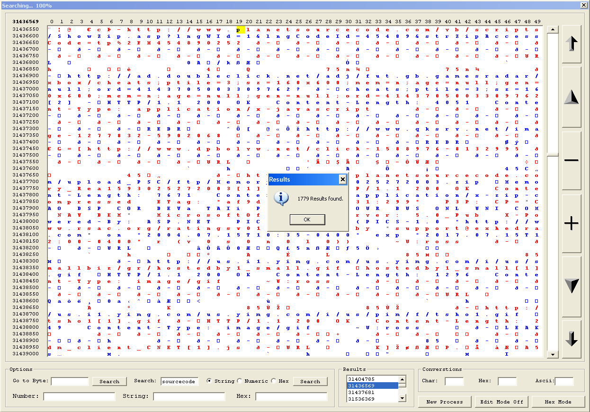

<div align="center">

## A Program Memory Hex Editor


</div>

### Description

View whats happening in a programs memory in hex or alpha format. Just like a standard hex editor only it allows you to view the programs memory rather than the program itself. Has the option to edit values in the programs memory. Also includes a search facility to find hex, string or numeric values in the memory. Still a work in progress so code is a bit messy but it seems to function with no problems.
 
### More Info
 


<span>             |<span>
---                |---
**Submitted On**   |2006-09-24 15:20:02
**By**             |[Ross](https://github.com/Planet-Source-Code/PSCIndex/blob/master/ByAuthor/ross.md)
**Level**          |Intermediate
**User Rating**    |5.0 (10 globes from 2 users)
**Compatibility**  |VB 6\.0
**Category**       |[Files/ File Controls/ Input/ Output](https://github.com/Planet-Source-Code/PSCIndex/blob/master/ByCategory/files-file-controls-input-output__1-3.md)
**World**          |[Visual Basic](https://github.com/Planet-Source-Code/PSCIndex/blob/master/ByWorld/visual-basic.md)
**Archive File**   |[A\_Program\_2021609242006\.zip](https://github.com/Planet-Source-Code/ross-a-program-memory-hex-editor__1-66637/archive/master.zip)

### API Declarations

```
Declare Function ReadProcessMemory Lib "kernel32" (ByVal hProcess As Long, ByVal lpBaseAddress As Any, ByVal lpBuffer As Any, ByVal nSize As Long, lpNumberOfBytesWritten As Long) As Long
Declare Function CloseHandle Lib "kernel32" (ByVal hObject As Long) As Long
```


